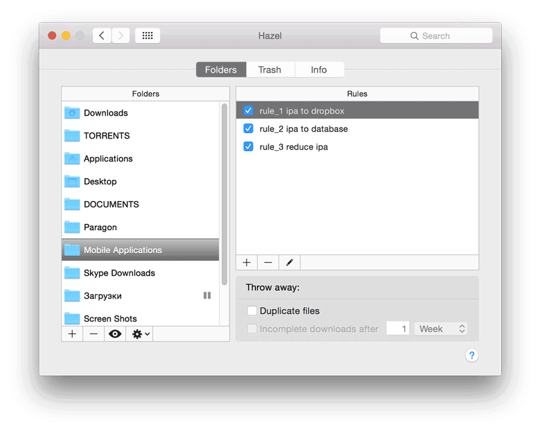

# Reduce iTunes *.ipa files

Upload *.ipa, reduce local files to savefree space. All files could be updated via iTunes.

## How it works
Get you APP_KEY & APP_SECRET from https://www.dropbox.com/developers/apps

**db_helper.py <filename>.ipa --dropbox**
*Uploads file to dropbox folder*

**db_helper.py <filename>.ipa --database**
*Export metainfo from *.ipa to plist database*

**db_helper.py <filename>.ipa --database**
*Export metainfo from *.ipa to plist database***

**db_helper.py <filename>.ipa --reduce_file**
*Reduce size of selected <filename>.ipa. File will be damaged, but the applications could be upgraded via itunes*

